== YubiKey Windows Login
Yubico has created a small utility that can secure access to a Windows computer when used in conjunction with a YubiKey. When properly configured, both the user’s password and YubiKey are required to gain access to the account. When using this tool it is highly recommended to configure a second, back-up YubiKey at the same time in the event access to the primary YubiKey is lost.

=== Required
This guide will show you how to enable a YubiKey to protect your Windows Login. To do so, you will need the following:

 - A local (non-cloud or domain) account on Windows 7 or 8 (32-bit or 64-bit)
 - YubiKey Hardware with firmware 2.2 or later. Should you wish to make a back-up YubiKey (highly recommended), please have another YubiKey available.
 - The YubiKey needs to be configured with our Personalization Tools for HMAC-SHA1 challenge-response with variable input in slot 2.
 - For optimal user experience, we recommend to not have “button press” configured for challenge-response. If button press is configured, please note you will have to press the YubiKey twice when logging in.
 

=== Installation
NOTE: You need to have administrator privileges to be able to install and you need to reboot your computer after the installation.

For Step-by-Step instructions, including how to configure your YubiKey in HMAC-SHA1 mode, please see the link:Releases[PDF guide].

. Download the link:Releases[Windows Login installer].

. Open the installation file and click _Install_.
+
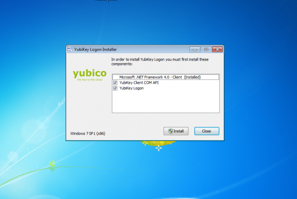

. Press _Yes_ in the User Account Control window.
+
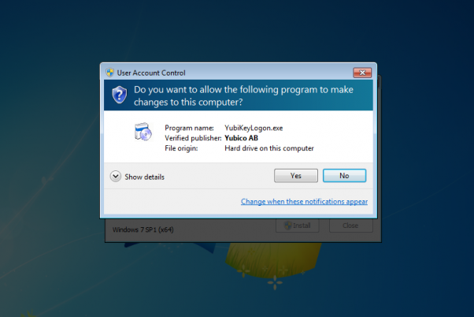

. Follow the setup wizard.
+
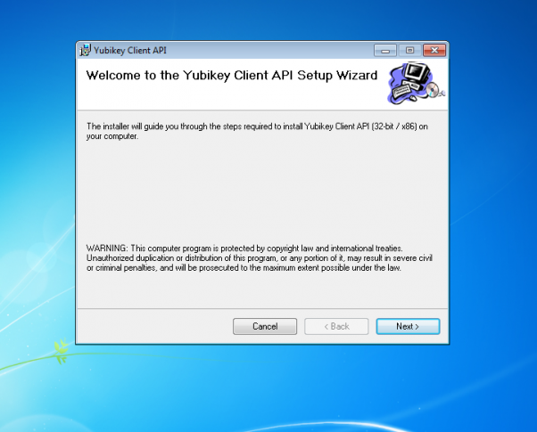

. Launch the YubiKey Logon Administration, that can be accessed from the start menu.
+
You will find it under the folder Yubico -> YubiKey Logon -> YubiKey Logon Administration.
+
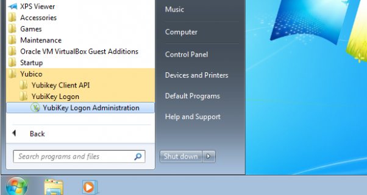

. Click _Yes_ in the User Account Control window.
+
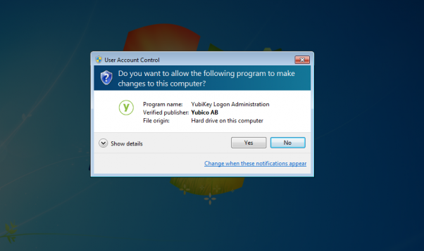

. Click _Yes_ to enable YubiKey Windows login for your computer.
+
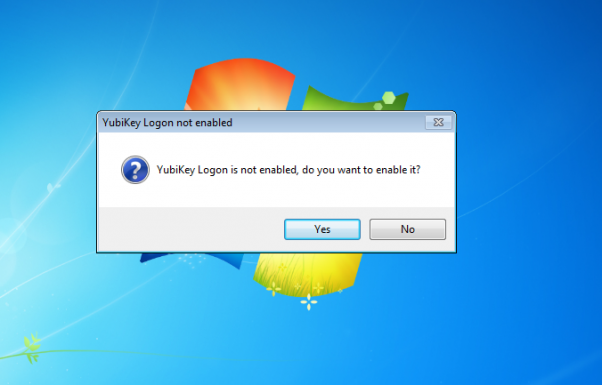

. Choose to reboot now or after associating the YubiKey with a user.
+
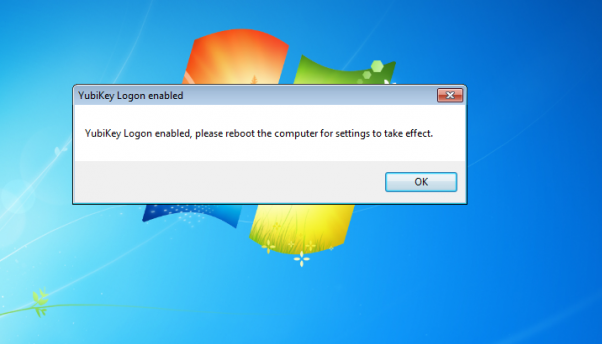

. Select user to configure in the drop down menu in the YubiKey Login Administration window.
+
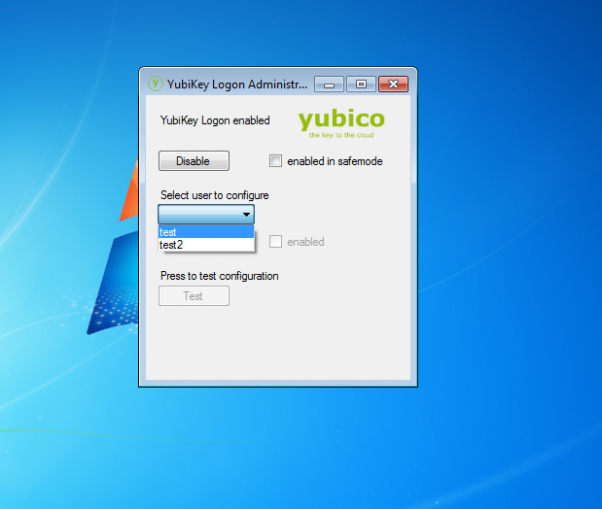

. If not already done so, please insert your YubiKey in the computer via a USB port.

. Click configure.
+
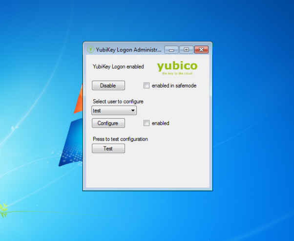

. Press _Yes_ to enable the YubiKey Login for the chosen user.
+
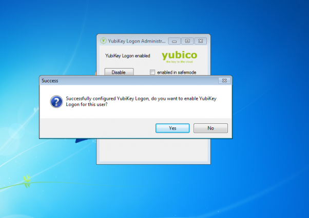

. Optional: click test to do a test with the YubiKey.
+
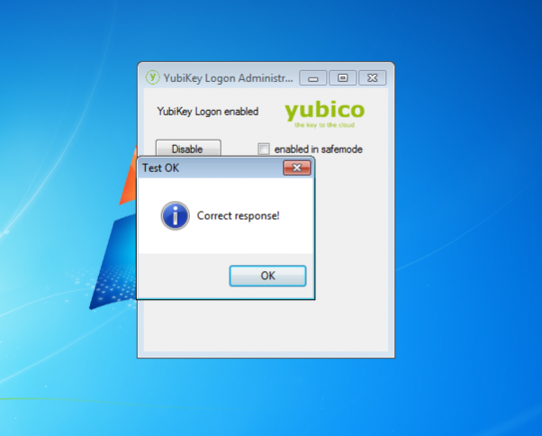

. If not already done so, reboot your computer.

. Login to Windows with the YubiKey inserted in a free USB port.
+
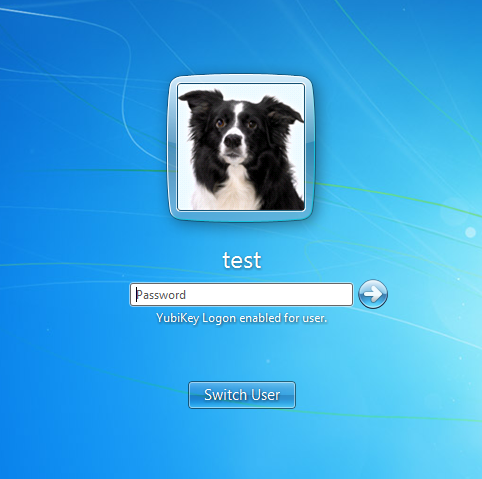

NOTE: Enter your ordinary password (not an OTP from the YubiKey) in the password field. The YubiKey challenge-response will take place without any user interaction.